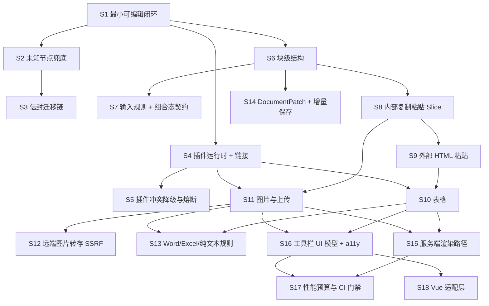

# 实施切片：可独立提交的垂直任务清单

配套文档：`docs/prd-and-tech-design.md`（需求与技术方案）。本文只解决"怎么分批做"，不重新设计方案；如实施中发现方案不成立，回到方案文档修改，不要边切边改。

## 0. 历史前置状态

本节记录立项时的基线，不描述当前仓库状态。

| 项 | 现状 |
| --- | --- |
| 工作区 | 干净，仅 `.gitignore` + `docs/prd-and-tech-design.md`，无混入的顺手改动可剔 |
| 代码 | 零 |
| 构建/测试链 | 不存在，由 S1 建立（只建 S1 需要的部分） |
| 回滚单位 | 一个切片 = 一个 commit。无线上环境，暂不需要 feature flag |
| 部署 | 暂无；playground 应用（`apps/playground`）是每一片的演示场地 |

## 0.1 当前交付状态（2026-08-15）

| 状态 | 切片 |
| --- | --- |
| 已合并 | S1–S18；S12 的演示服务与可替换服务契约位于 `apps/remote-image-service` 和 `packages/editor-remote-image-service`。S13 的 y-prosemirror 前置验证已记录在 `docs/y-prosemirror-compatibility.md`。 |
| 待决策 | 无。 |

S17 的已交付范围是基准文档、五项 Node/jsdom 测量、`getDocument()` 快照缓存和 CI 门禁。字数统计与 NodeView 懒挂载尚无对应的公开能力或 NodeView，后续在引入这些能力时单独实现和测量。

## 1. 本项目的三条切片原则

编辑器最容易切成横片（"先把 Schema 全建完""先搭插件系统"），那样没有一片能演示，最后一次性合，崩了无从定位。因此：

1. **基础设施跟着它的第一个消费者进场，不单独成片。** 插件运行时随第一个可选插件（S4）；位置映射与异步契约随图片上传（S11）；组合态契约随输入规则（S7）；`DocumentPatch` 随增量保存（S14）。
2. **每片自带它的 Schema、命令、UI、剪贴板映射和测试。** 表格片包含"HTML table → `co_table`"的解析映射，不留到粘贴片再补；图片片包含拖入/粘贴/上传/回填全路径。
3. **降级即完整，不是占位符。** 表格插件还不存在时，粘贴进来的 table 按 §11.3 降级为段落——这是已定义行为，该片是完整的；等表格片上线后映射自然升级。这与"留个 TODO 等下片接"不同。

## 2. 依赖关系



可并行的三条链（拆完随时并行推进，互不阻塞）：

- **数据链**：S2 → S3 → S14
- **内容链**：S6 → S8 → S9 → S10 → S11 → S13
- **平台链**：S4 → S5，以及后段的 S15 / S16 → S17 / S18

## 3. 切片清单（按上线顺序）

### S1. 最小可编辑闭环（tracer bullet）· AFK

- **动什么**：`editor-schema`（冻结核心集最小子集：`doc`/`paragraph`/`text` + `strong`/`em`）、`editor-pm-adapter`（EditorState/EditorView 装配）、`editor-runtime`（命令注册、事务包装、`recordHistory` 抽象）、`editor-api`（`RichEditor` 骨架：`mount/unmount/destroy`、`execute/queryCommand`、`getSnapshot`、`loadDocument/getDocument`）、`editor-react`（Provider + Content + `useEditorSelector`）、`apps/playground`。仅建立本片需要的 monorepo/tsconfig/测试链。信封格式 `{envelope, schemaVersion, plugins, doc, annotations}` 在此定型。
- **演示**：playground 打开 → 输入文字 → Cmd+B 加粗 → 点"保存"看到信封 JSON → 刷新页面重新加载，文字与格式都在；工具栏的加粗按钮在选区里正确高亮。
- **验证**：`pnpm test`（信封 round-trip 字节一致、`queryCommand('format.bold').active` 正确、`mount/unmount` 幂等）；`pnpm dev` 在 StrictMode 下双挂载不报错、内容不丢。
- **回滚**：单 commit，仓库回到只有文档的状态。
- **依赖**：无。
- **PRD**：§8.1、§8.2、§9.1、§9.4、§10.1、§10.2

### S2. 未知节点兜底（防内容丢失）· AFK

- **动什么**：`unknown_block` / `unknown_inline` 加入冻结核心集；加载时把 Schema 中不存在的节点包装为兜底节点并在 `attrs.original` 原样保存整棵子树；只读占位渲染；未知 mark 丢标记保文本；`LoadResult { migrated, unknownNodes, degraded }`；`documentDegraded` 事件；fixture 文档。
- **演示**：加载 `fixtures/doc-with-unknown.json`（含 `co_foo` 节点）→ 显示只读占位"此内容需要 X 功能才能显示与编辑" → 在旁边段落输入文字 → 保存 → 未知节点原样存在。
- **验证**：`pnpm test` 中的 round-trip 断言必须字节一致（含子树、含 `plugins` 版本号）；占位块不可内部编辑、可整体选中删除。
- **回滚**：单 commit。**注意**：一旦有真实用户文档落库，本片不可回滚（见 §4）。
- **依赖**：S1。
- **为什么排这么前**：这是 P0 数据丢失防线，且用 fixture 造未知节点即可验证，不需要任何真实插件存在。晚于第一个 `co_` 节点上线就来不及了。
- **PRD**：§9.3、§16.2

### S3. 信封迁移链 · AFK

- **动什么**：`schemaVersion` 迁移链执行器（每步一个纯函数 `(envelope) => envelope`）；第一条真实迁移——把裸 `doc` JSON（无信封的旧格式/手写 JSON）包装为 `envelope:1`；未知节点在迁移中原样透传，绝不参与结构改写；写回时更新 `schemaVersion` 与 `plugins`。
- **演示**：加载一份没有信封的裸 `{type:'doc',...}` JSON → 自动升级为信封格式并可编辑保存；加载含未知节点的旧格式 → 升级后未知节点字节一致。
- **验证**：迁移单测（fixture 前后对照）+ 反向函数（或明确标注不可逆）+ 含未知节点的透传断言。
- **回滚**：单 commit；回滚后旧格式 JSON 加载失败，但已入库的信封格式文档不受影响。
- **依赖**：S2（未知节点透传是迁移的硬约束，顺序反了就会在迁移里把未知节点改坏）。
- **PRD**：§12.2

### S4. 插件运行时 + 首个可选插件（链接）· AFK

- **动什么**：`EditorPlugin` 契约、依赖拓扑排序、Schema/命令/快捷键注册中心、命名空间启动期校验 + lint（非冻结集且无 `co_` 前缀即拒绝）；`editor-plugin-link`（`co_link` mark、`link.set/unset/open` 命令、URL 协议白名单 `https/http/mailto/tel`、外链强制 `rel="noopener noreferrer"`）。
- **演示**：配置里装上 link 插件 → 选中文字加链接可用，粘贴 `javascript:` URL 被拒；配置里去掉该插件 → 无链接能力，编辑器其余功能正常。
- **验证**：单测（协议白名单全表、命名空间非法名被拒且报出插件名与冲突项）；playground 两种插件配置各跑一次。
- **回滚**：单 commit；已存在的 `co_link` mark 在回滚后走 S2 兜底（mark 丢标记保文本），不丢内容。
- **依赖**：S1。
- **为什么用链接做第一个插件**：它是最薄的一个真实可选能力（一个 mark + 三个命令），足以把注册中心、命名空间校验、装/不装两种配置全部验证到，不必先造一个大插件。
- **PRD**：§8.3、§9.2、§11.3

### S5. 插件冲突降级与错误熔断 · AFK

- **动什么**：四类冲突处理（循环依赖 / 重复节点名 / 重复命令名 / 缺失依赖）→ 降级启动而非启动失败；`pluginError` 事件；runtime 包裹全部插件入口点；捕获后禁用插件 + 以最后一次已知良好文档重建 `EditorView` + 保留选区；60 秒内 3 次熔断阈值；宿主可见的降级提示。
- **演示**：playground 加"注入故障插件"开关 → 打开后该插件被禁用、顶部提示"X 功能暂时不可用，内容已保留"、其余内容照常可编辑、文档内容一字不丢。
- **验证**：单测（四类冲突各一例、抛错插件被熔断、重建后选区位置）；playground 手动开关一次。
- **回滚**：单 commit。
- **依赖**：S4。
- **PRD**：§8.3、§8.6

### S6. 块级结构 · AFK

- **动什么**：冻结核心集其余块节点（`heading` h1–h4、`blockquote`、`horizontal_rule`、`bullet_list`/`ordered_list`/`list_item`、`task_list`/`task_item`、`code_block`、`hard_break`）**与其余核心标记**（`underline`、`strikethrough`、`code`）+ 对应命令与快捷键 + 工具栏按钮 + 只读/禁用三态。
- **为什么标记也在这片**：§4 的不可回滚边界写明"冻结核心节点/标记名"定型于 S1、S6，而后续没有任何一片认领这三个标记；漏在这里就等于让冻结集在有真实数据之后才补全，那时改名等于全量迁移。
- **演示**：段落转 h1–h4、无序/有序/待办列表（含嵌套与升降级）、引用、分隔线、代码块；每种转换的撤销重做都正确。
- **验证**：单测覆盖每种转换 + 每种转换的 undo/redo + 列表嵌套边界；playground 手动走一遍。
- **回滚**：单 commit；同 S2 的落库边界。
- **依赖**：S1。
- **PRD**：§4.1、§9.2

### S7. 输入规则 + 组合态契约 · AFK

- **动什么**：输入规则（`# `→标题、`- `/`* `→无序列表、`1. `→有序列表、`> `→引用、` ``` `→代码块）；runtime 全局 `composing` 标志 + `compositionChanged` 事件 + `SelectionSnapshot.composing`；组合态期间挂起非用户输入事务并入队、`compositionend` 后合并应用并重映射位置；冻结覆盖当前文本节点的 Decoration 更新；输入规则在组合态不执行；`execute()` 返回 `{ok:false, reason:'composing'}`；5 秒兜底超时；智能标点默认关闭。
- **演示**：中文输入法下在行首打拼音（如输入"减号"的拼音）不误触发列表转换、不断字、不漏字；组合态中程序化事务被挂起，上屏后一次性应用。
- **验证**：Playwright + CDP composition 事件自动化用例（组合态触发输入规则、组合态收到程序化事务、组合态 Decoration 冻结三条）；真机手动矩阵 §16.4（macOS 拼音、Windows 微软拼音、Android Gboard、iOS 拼音）。
- **回滚**：单 commit。
- **依赖**：S6（输入规则要有目标块类型才有意义）。
- **为什么和输入规则同片**：输入规则是打字过程中第一个真实的程序化文档修改源，也是组合态冲突最典型的现场。组合态契约单独成片无法演示，跟输入规则一起才是竖切。
- **PRD**：§4.4、§9.6、§16.4

### S8. 内部复制粘贴（Slice + `data-co-slice`）· AFK

- **动什么**：`serializeSlice` / `parseSlice`（含 `openStart` / `openEnd`）；高保真 payload 写在 `text/html` 根元素 `data-co-slice` 属性上；`text/plain` 降级；可选自定义 MIME 快路径；粘贴优先级骨架（组合态拒绝 → `data-co-slice` → 文件 → HTML → 纯文本）；代码块内一律纯文本；`Cmd/Ctrl+Shift+V` 在 keydown 记标志位、在 paste 只读 `text/plain`；`fixtures/clipboard/` 语料库骨架 + 重录命令。
- **演示**：复制列表中间两项 → 粘到另一处层级正确；跨段落中部的选区复制粘贴不错乱；Cmd+Shift+V 只粘纯文本；复制的内容粘到外部应用（如备忘录）保留语义 HTML。
- **验证**：单测（`openStart`/`openEnd` 各边界组合）+ 自产 dump 的 golden diff。
- **回滚**：单 commit。
- **依赖**：S6（要有列表/标题等结构才能验证开合深度）。
- **PRD**：§11.1、§11.2、§16.1、§16.5

### S9. 外部 HTML 粘贴（Schema 白名单 + inert 解析）· AFK

- **动什么**：`new DOMParser().parseFromString(html,'text/html')` 的 inert 解析管线（明令禁止把不可信 HTML 赋给活文档 `innerHTML`）；噪音清理（`mso-*`、冗余 `span`、布局样式、外部 CSS）；`parseDOM` 映射；属性策略（除白名单外全丢）；降级规则（`h5`/`h6`→`h4`、未支持块→段落、未支持行内→保留文本、无法成结构→纯文本）。
- **演示**：从任意网页复制一段含 `<script>`、`onclick`、`javascript:` 链接和追踪像素的 HTML → 标题/列表/链接语义保留、脚本不执行、危险链接被拒。
- **验证**：单测 + Playwright 网络断言：粘贴含追踪像素的 HTML 时**解析阶段网络请求数为 0**；golden diff。
- **回滚**：单 commit。
- **依赖**：S8（共用粘贴优先级与管线）、S4（链接协议白名单）。
- **本片的完整性**：此时表格/图片插件尚不存在，粘贴进来的 `table`/`img` 按降级规则落为段落与文本——这是已定义行为，不是占位符。
- **PRD**：§11.3、§13、§16.3

### S10. 表格 · AFK

- **动什么**：`co_table` / `co_table_row` / `co_table_cell` / `co_table_header`；插入、增删行列、合并/拆分单元格命令；键盘导航（方向键跨单元格、Tab 到下一格、行末 Tab 新增行）；**HTML `table` → `co_table` 的解析映射，保留 `colspan`/`rowspan` 并钳制到 1000**；单表 5000 单元格上限。
- **演示**：插入 3×3 表格、合并两个单元格、Tab 走到行末自动加行；从网页复制一张含合并单元格的表格粘进来结构不变。
- **验证**：单测（每个命令 + undo、colspan/rowspan round-trip、上限钳制）；网页表格 dump 的 golden diff；键盘导航走查。**外加一条 S2 联动验收**：含表格的文档在未装表格插件的实例中打开 → 只读占位 → 编辑别处保存 → 完整环境重新打开，表格无损。
- **回滚**：单 commit；已有 `co_table` 文档回滚后走 S2 兜底，不丢内容（这正是 S2 排在前面的价值）。
- **依赖**：S9（HTML 解析管线）、S4（插件运行时）。
- **PRD**：§4.2、§11.3、§16.1、§16.2

### S11. 图片与上传（位置映射契约首个消费者）· AFK

- **动什么**：`co_image`；`AssetUploader` 协议（含 `uploadId`、`AbortSignal`、`discard`）；**上传态不进文档**——`uploadId`/进度/错误存 plugin state，每个事务用 `tr.mapping.map()` 迁移位置，用 `Decoration` 渲染占位与进度；回填事务 `recordHistory:false`；复制上传中节点时剥离 `uploadId`；目标位置消失时丢弃结果并调 `discard()`；unmount 时 abort；本地选择 / 拖入 / 剪贴板三个入口；失败重试按映射后位置定位；`data:` URL 仅作预览、禁止入文档。
- **演示**：拖入一张图 → 占位 + 进度 → 完成显示；**上传中在图片前面插入大段文字，上传完成后图片仍落在正确位置**；上传成功后按一次 undo 不回退到 loading；上传中撤销删除图片，完成时调用 `discard`。
- **验证**：单测（mapping 迁移、`discard` 调用、复制去 ID、`recordHistory:false`）+ playground 手动跑上述四个场景。
- **回滚**：单 commit。
- **依赖**：S8（复制路径要剥离 uploadId）、S4。
- **PRD**：§8.5、§9.5、§16.2

### S12. 远端图片转存与 SSRF 控制 · AFK

- **动什么**：远端图片一律通过服务端转存，不热链；演示服务位于 `apps/remote-image-service`，核心策略与 `RemoteImageServices` 可替换契约位于 `packages/editor-remote-image-service`。五条 SSRF 控制为协议仅 http/https、DNS 解析后拒私有网段/回环/链路本地/元数据地址、每跳重定向复检、10MB + 5 秒上限、`Content-Type` 与实际字节嗅探双校验。服务成功后只返回最终资产 URL，宿主通过 `image.insertAsset` 持久化该地址。
- **演示**：粘贴含远端图片的网页内容 → 图片被转存为对象存储 URL；构造指向 `127.0.0.1` / `169.254.169.254` / 302 跳内网的图片 → 全部被拒并提示。
- **验证**：SSRF 用例集单测覆盖私网/元数据地址、重定向跳转和伪造图片；运行 `pnpm demo:remote-image-service` 可启动本地服务。
- **回滚**：单 commit；回滚后远端图片按"丢弃并提示"处理，不回退到热链。
- **依赖**：S11。
- **PRD**：§11.3.1、§13、§16.3

### S13. Word / Excel / 纯文本来源规则 + 阈值 · AFK

- **动什么**：Word 专项（保留标题/段落/列表/表格/链接/基础样式，舍弃页面布局；`file:` 图片一律丢弃并提示"请手动插入图片"）；Excel 专项（优先解析剪贴板 HTML 表格，注意 `<!--StartFragment-->`；仅无 HTML 时按 TSV 兜底且**必须按引号转义规则解析**）；纯文本 URL 转链接/应用于选区；§14.2 全部硬上限的拒绝与提示。
- **演示**：从 Word 粘一段含标题、列表、表格的内容，结构语义保留、无页面样式污染；从 Excel 粘一个含制表符与换行的单元格，不被拆成多格。
- **验证**：`fixtures/clipboard/` 真实 dump 全量 golden diff——Word、Excel、普通网页、飞书、Notion、微信公众号、Google Docs 各至少一组（三种 MIME 全存）。这是唯一能防住"修了 Word 又坏了 Notion"的机制。
- **回滚**：单 commit。
- **依赖**：S10（Excel 要落成表格）、S11（Word 图片规则）、S9。
- **PRD**：§11.4、§14.2、§16.1、§16.5

### S14. DocumentPatch + 增量保存 · AFK

- **动什么**：`DocumentPatch v1` 与 `PatchOp` 定义在 `editor-shared-types`；`editor-pm-adapter` 做 Step ↔ PatchOp 双向转换；`patch` 事件；`getRevision()` / `isDirty()`；乐观并发校验（`patch.from === 当前 revision`，不匹配拒绝并要求重放）；自动保存节流（2 秒空闲或累计 50 次变更，先到者触发）；playground 加 patch 面板与"重放"按钮。
- **演示**：编辑时面板里出现 patch 而非全文；点"从空文档重放全部 patch" → 得到与当前编辑器内容完全一致的文档；用过期 revision 提交 → 被拒。
- **验证**：属性测试（随机编辑序列的 patch 重放结果与直接编辑结果等价）+ 逆变更回滚单测 + 节流单测。
- **回滚**：单 commit；回滚后退回全量保存，无数据损坏。
- **依赖**：S6（要有足够多的变更类型才验证得充分）。可与内容链并行。
- **为什么现在做而不是留到 M4**：协同、评论、版本历史、AI 全部以它为前置；事后为已成型的全链路补一条变更流，成本比一开始就有它高一个数量级。
- **PRD**：§8.4、§12.3

### S15. 服务端渲染路径 · AFK

- **动什么**：`DOMOutputSpec` → HTML 字符串的纯 JS walker（无 DOM 依赖）；`toDOM` 禁止访问 `document` 的 lint 规则 + 单测；`pnpm render <doc.json>` CLI；服务端不接受客户端 HTML 的约定落到代码（`parseHTML` 只在客户端管线内）。
- **演示**：`pnpm render fixtures/doc-full.json > out.html` 在纯 Node 环境（**不装 jsdom**）跑通；输出与浏览器端 `getHTML()` 字节一致。
- **验证**：前后端一致性单测（同一 fixture 两端比对全等）+ lint 在 CI 生效（故意写一个碰 `document` 的 `toDOM` 应失败）。
- **回滚**：单 commit。
- **依赖**：S10、S11（要有表格/图片这类复杂节点，一致性验证才有意义）。
- **PRD**：§7.1、§12.1

### S16. 工具栏 UI 模型 + 无障碍 · AFK

- **动什么**：`editor-ui-model`（项与分组、enabled/active/value 计算、下拉开合规则、浮动工具栏出现条件与定位输入、roving tabindex 顺序）；`editor-react-ui` 只做渲染；ARIA `toolbar` 模式；`Esc` 关闭弹层且焦点返回原位；上传状态 `aria-live` 通知；编辑区可访问名称与角色；只读态与禁用态语义区分；对比度 WCAG AA。
- **演示**：全程不碰鼠标完成加粗 → 转二级标题 → 插入 3×3 表格 → 在单元格里插入链接 → 插入图片；屏幕阅读器读出工具栏项与当前状态。
- **验证**：axe 自动检查通过 + 键盘走查清单逐项 + `editor-ui-model` 的状态机单测（与框架无关，可直接断言）。
- **回滚**：单 commit。
- **依赖**：S10、S11（工具栏项要够多才撑得起状态机）。
- **为什么 a11y 不单独成片**：无障碍单独排在最后是必然被砍掉的横片。它属于工具栏行为，和 UI 模型同片交付。
- **PRD**：§10.4、§15

### S17. 性能预算与 CI 门禁 · AFK

- **已交付**：基准文档生成器（5 万字 / 300 段 / 50 图 / 20 表 / 4 层列表）；五项 Node/jsdom 测量（编辑器挂载、格式化后的 DOM 状态更新 p95、粘贴 1 万字、工具栏状态更新、内存增量）；`getDocument()` 状态快照缓存；CI 超预算 20% 失败。
- **后续触发项**：字数统计增量维护与 NodeView 懒挂载。当前没有公开字数统计接口或自定义 NodeView；引入任一能力时必须在同一变更中补实现、基准和预算。
- **演示与验证**：`pnpm bench` 输出五项指标与预算对照表；`Quality` CI 执行该命令。阈值校准与三次采样记录见 `docs/performance-budgets.md`。
- **回滚**：单 commit；回滚只是去掉门禁，不影响功能。
- **依赖**：S15、S16（需要完整内容类型与 UI 才测得准）。
- **PRD**：§14

### S18. Vue 适配层 · AFK

- **已交付**：`editor-vue` 提供实例注入、`EditorContent` 与 `useEditorSnapshot` / `useCommandQuery` 等 Composable；`editor-vue-ui` 使用同一个 `editor-ui-model` 渲染 ARIA toolbar。组件在 `onMounted` 调用 `mount`，在 `onBeforeUnmount` 调用 `unmount`，不销毁业务实例。
- **NodeView 约束**：当前内核尚无自定义 NodeView；首个 Vue NodeView 必须通过 `<Teleport>` 渲染进宿主应用树，不能创建独立 Vue app。
- **验证**：Vue 侧挂载/卸载保留实例，工具栏可执行命令；两者均由 jsdom 单测覆盖。
- **回滚**：单 commit，不影响 React 链路。
- **依赖**：S16（复用 UI 模型，否则两套 UI 必然行为漂移）。

### S19. 图片二次编辑 · AFK

- **动什么**：`co_image` 增加 `displayWidth`/`crop`/`rotate`/`filter`/`align`（`structureVersion` 2，旧文档由默认值补齐，无需迁移）；命令补齐 `image.update`（一次写一组，模态"应用"用）、`image.setAlt`/`resize`/`setAlign`/`rotate`/`setFilter`/`crop`/`remove`/`replace`/`selected`。**二次编辑一律非破坏性**：只写属性，不重新上传、不把像素烘进新资产，因此每一步都能回去再改。裁剪矩形以原图比例记录，交互式裁剪按矩形合成并按当前旋转反算坐标；替换走既有 `AssetUploader`，上传期间原图照常显示，成功才换资产并清掉旧裁剪。渲染推导成 wrapper/frame/img 三层内联样式，`getHTML()` 脱离样式表也保真。
- **演示**：单击图片浮出快捷条（旋转 / 环绕 / 替换 / 删除）；双击进入模态，在整幅原图上拖出裁剪框、挑滤镜、调尺寸与替代文本，"应用"后撤销一步回到改之前；替换失败保留原图并可重试。
- **验证**：属性模型与布局推导的纯函数单测（归一化、裁剪合成、旋转换算、样式推导）；命令与替换流程的行为单测；服务端渲染与浏览器渲染一致性。
- **已知边界**：裁剪与旋转需要上传服务返回原始尺寸，缺尺寸时这两项禁用而不是渲染成别的样子。内联样式经 CSSOM 会被各引擎重排，浏览器/服务端一致性因此在同一个 CSS 序列化器下断言，服务端字节由 `tests/server-render.test.ts` 钉住。
- **回滚**：单 commit；回滚后已写入的编辑属性被 Schema 默认值忽略，图片退回原始资产显示，内容不丢。
- **依赖**：S11（上传与位置映射）、S16。

## 4. 不可回滚边界

以下内容一旦有**真实用户文档落库**就不可回滚，必须在接入任何真实业务数据之前做完做对：

| 内容 | 定型于 | 改动代价 |
| --- | --- | --- |
| 信封结构 `{envelope, schemaVersion, plugins, doc, annotations}` | S1 | 全量数据迁移 |
| 冻结核心节点/标记名（不带前缀的那一批） | S1、S6 | 全量数据迁移 |
| 插件节点的 `co_` 命名空间规则 | S4 | 全量数据迁移 |
| `unknown_block` / `unknown_inline` 的 `attrs.original` 语义 | S2 | 旧文档兜底内容失效，可能丢内容 |
| `DocumentPatch` 的位置语义（文档扁平偏移量） | S14 | 已存 patch 历史失效 |
| 评论锚点存在信封外部（不做 mark） | S1（字段占位） | 评论数据迁移 |

其余切片在有真实数据后仍可安全 revert：功能消失，但已有文档因 S2 兜底不丢内容。**这就是 S2 必须排在所有 `co_` 节点之前的原因。**

## 5. 已落实的 HITL 决策

只有一片是 HITL，且因为一个待定事实，不是因为技术不清楚：

所有原先的 HITL 决策均已落实：S12 选择在本仓库提供 Node 演示服务和可替换服务契约；S18 已交付 Vue 适配层与工具栏实现。

另有一项**不构成切片的前置义务**（方案 §9.4）：在 S13 完成前完成 `y-prosemirror` 与本方案 Schema/NodeView（尤其表格与自定义 NodeView）的兼容性验证。它是一个决策任务不是可上线的片，产出是一个结论：M4 换 Yjs UndoManager 时影响面是否仍限于 `editor-pm-adapter`。别拖到 M4 才发现不兼容。

## 6. 与方案里程碑的对应

| 方案 §17 阶段 | 切片 |
| --- | --- |
| M1 内核与不可逆决策 | S1 – S8、S14 |
| M2 内容能力与第二框架 | S9 – S13、S15、S18 |
| M3 平台化 | S5（可提前）、S16、S17 |
| M4 高级能力 | 本清单不覆盖；以 S14 的 patch 流与 S1 的 `annotations` 字段为入口 |

---

切片已就绪。逐片实现，每片上线前跑 `/check` 过一遍发布门禁。
