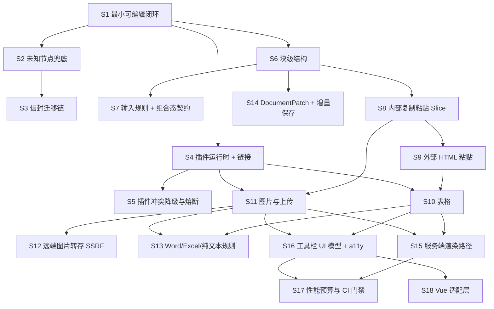

# 实施切片：可独立提交的垂直任务清单

配套文档：`docs/prd-and-tech-design.md`（需求与技术方案）。本文只解决"怎么分批做"，不重新设计方案；如实施中发现方案不成立，回到方案文档修改，不要边切边改。

## 0. 历史前置状态

本节记录立项时的基线，不描述当前仓库状态。

| 项 | 现状 |
| --- | --- |
| 工作区 | 干净，仅 `.gitignore` + `docs/prd-and-tech-design.md`，无混入的顺手改动可剔 |
| 代码 | 零 |
| 构建/测试链 | 不存在，由 S1 建立（只建 S1 需要的部分） |
| 回滚单位 | 一个切片 = 一个 commit。无线上环境，暂不需要 feature flag |
| 部署 | 暂无；playground 应用（`apps/playground`）是每一片的演示场地 |

## 0.1 当前交付状态（2026-08-17）

| 状态 | 切片 |
| --- | --- |
| 已合并 | S1–S31 全部切片，含补记的 S19.5（文字颜色与背景色，实际早于 S19 合入）。S12 的演示服务与可替换服务契约位于 `apps/remote-image-service` 和 `packages/editor-remote-image-service`；S28 照同一形态给出 `apps/collab-server` 与 `packages/editor-collab`。S13 的 y-prosemirror 前置验证记录在 `docs/y-prosemirror-compatibility.md`，S28 又往里补了三条实测结论。 |
| 未实现 | 无——切片清单已全部交付。 |
| 待决策 | 无。 |

S17 的已交付范围是基准文档、六项 Node/jsdom 测量、`getDocument()` 快照缓存和 CI 门禁。字数统计随 S23 补上了自己的测量（`wordCountMs`）；NodeView 懒挂载尚无对应的 NodeView，后续在引入该能力时单独实现和测量。

方案里仍未认领的欠账（不是"排期未到"，是清单里没有对应切片）：

| 欠账 | 方案条目 | 状态 |
| --- | --- | --- |
| 性能预算按真实 CI 历史与业务样本校准 | §14 | 机制已就位（S27），**校准本身卡在数据上**：需要同环境三次以上的真实 CI 记录，编不出来。业务样本要等有真实文档。 |
| M4：评论、版本历史 | §17 | 已全部实现（S28 协同、S29 评论、S30 版本历史、S31 AI）。 |

## 1. 本项目的三条切片原则

编辑器最容易切成横片（"先把 Schema 全建完""先搭插件系统"），那样没有一片能演示，最后一次性合，崩了无从定位。因此：

1. **基础设施跟着它的第一个消费者进场，不单独成片。** 插件运行时随第一个可选插件（S4）；位置映射与异步契约随图片上传（S11）；组合态契约随输入规则（S7）；`DocumentPatch` 随增量保存（S14）。
2. **每片自带它的 Schema、命令、UI、剪贴板映射和测试。** 表格片包含"HTML table → `co_table`"的解析映射，不留到粘贴片再补；图片片包含拖入/粘贴/上传/回填全路径。
3. **降级即完整，不是占位符。** 表格插件还不存在时，粘贴进来的 table 按 §11.3 降级为段落——这是已定义行为，该片是完整的；等表格片上线后映射自然升级。这与"留个 TODO 等下片接"不同。

## 2. 依赖关系



可并行的三条链（拆完随时并行推进，互不阻塞）：

- **数据链**：S2 → S3 → S14
- **内容链**：S6 → S8 → S9 → S10 → S11 → S13
- **平台链**：S4 → S5，以及后段的 S15 / S16 → S17 / S18

## 3. 切片清单（按上线顺序）

### S1. 最小可编辑闭环（tracer bullet）· AFK

- **动什么**：`editor-schema`（冻结核心集最小子集：`doc`/`paragraph`/`text` + `strong`/`em`）、`editor-pm-adapter`（EditorState/EditorView 装配）、`editor-runtime`（命令注册、事务包装、`recordHistory` 抽象）、`editor-api`（`RichEditor` 骨架：`mount/unmount/destroy`、`execute/queryCommand`、`getSnapshot`、`loadDocument/getDocument`）、`editor-react`（Provider + Content + `useEditorSelector`）、`apps/playground`。仅建立本片需要的 monorepo/tsconfig/测试链。信封格式 `{envelope, schemaVersion, plugins, doc, annotations}` 在此定型。
- **演示**：playground 打开 → 输入文字 → Cmd+B 加粗 → 点"保存"看到信封 JSON → 刷新页面重新加载，文字与格式都在；工具栏的加粗按钮在选区里正确高亮。
- **验证**：`pnpm test`（信封 round-trip 字节一致、`queryCommand('format.bold').active` 正确、`mount/unmount` 幂等）；`pnpm dev` 在 StrictMode 下双挂载不报错、内容不丢。
- **回滚**：单 commit，仓库回到只有文档的状态。
- **依赖**：无。
- **PRD**：§8.1、§8.2、§9.1、§9.4、§10.1、§10.2

### S2. 未知节点兜底（防内容丢失）· AFK

- **动什么**：`unknown_block` / `unknown_inline` 加入冻结核心集；加载时把 Schema 中不存在的节点包装为兜底节点并在 `attrs.original` 原样保存整棵子树；只读占位渲染；未知 mark 丢标记保文本；`LoadResult { migrated, unknownNodes, degraded }`；`documentDegraded` 事件；fixture 文档。
- **演示**：加载 `fixtures/doc-with-unknown.json`（含 `co_foo` 节点）→ 显示只读占位"此内容需要 X 功能才能显示与编辑" → 在旁边段落输入文字 → 保存 → 未知节点原样存在。
- **验证**：`pnpm test` 中的 round-trip 断言必须字节一致（含子树、含 `plugins` 版本号）；占位块不可内部编辑、可整体选中删除。
- **回滚**：单 commit。**注意**：一旦有真实用户文档落库，本片不可回滚（见 §4）。
- **依赖**：S1。
- **为什么排这么前**：这是 P0 数据丢失防线，且用 fixture 造未知节点即可验证，不需要任何真实插件存在。晚于第一个 `co_` 节点上线就来不及了。
- **PRD**：§9.3、§16.2

### S3. 信封迁移链 · AFK

- **动什么**：`schemaVersion` 迁移链执行器（每步一个纯函数 `(envelope) => envelope`）；第一条真实迁移——把裸 `doc` JSON（无信封的旧格式/手写 JSON）包装为 `envelope:1`；未知节点在迁移中原样透传，绝不参与结构改写；写回时更新 `schemaVersion` 与 `plugins`。
- **演示**：加载一份没有信封的裸 `{type:'doc',...}` JSON → 自动升级为信封格式并可编辑保存；加载含未知节点的旧格式 → 升级后未知节点字节一致。
- **验证**：迁移单测（fixture 前后对照）+ 反向函数（或明确标注不可逆）+ 含未知节点的透传断言。
- **回滚**：单 commit；回滚后旧格式 JSON 加载失败，但已入库的信封格式文档不受影响。
- **依赖**：S2（未知节点透传是迁移的硬约束，顺序反了就会在迁移里把未知节点改坏）。
- **PRD**：§12.2

### S4. 插件运行时 + 首个可选插件（链接）· AFK

- **动什么**：`EditorPlugin` 契约、依赖拓扑排序、Schema/命令/快捷键注册中心、命名空间启动期校验 + lint（非冻结集且无 `co_` 前缀即拒绝）；`editor-plugin-link`（`co_link` mark、`link.set/unset/open` 命令、URL 协议白名单 `https/http/mailto/tel`、外链强制 `rel="noopener noreferrer"`）。
- **演示**：配置里装上 link 插件 → 选中文字加链接可用，粘贴 `javascript:` URL 被拒；配置里去掉该插件 → 无链接能力，编辑器其余功能正常。
- **验证**：单测（协议白名单全表、命名空间非法名被拒且报出插件名与冲突项）；playground 两种插件配置各跑一次。
- **回滚**：单 commit；已存在的 `co_link` mark 在回滚后走 S2 兜底（mark 丢标记保文本），不丢内容。
- **依赖**：S1。
- **为什么用链接做第一个插件**：它是最薄的一个真实可选能力（一个 mark + 三个命令），足以把注册中心、命名空间校验、装/不装两种配置全部验证到，不必先造一个大插件。
- **PRD**：§8.3、§9.2、§11.3

### S5. 插件冲突降级与错误熔断 · AFK

- **动什么**：四类冲突处理（循环依赖 / 重复节点名 / 重复命令名 / 缺失依赖）→ 降级启动而非启动失败；`pluginError` 事件；runtime 包裹全部插件入口点；捕获后禁用插件 + 以最后一次已知良好文档重建 `EditorView` + 保留选区；60 秒内 3 次熔断阈值；宿主可见的降级提示。
- **演示**：playground 加"注入故障插件"开关 → 打开后该插件被禁用、顶部提示"X 功能暂时不可用，内容已保留"、其余内容照常可编辑、文档内容一字不丢。
- **验证**：单测（四类冲突各一例、抛错插件被熔断、重建后选区位置）；playground 手动开关一次。
- **回滚**：单 commit。
- **依赖**：S4。
- **PRD**：§8.3、§8.6

### S6. 块级结构 · AFK

- **动什么**：冻结核心集其余块节点（`heading` h1–h4、`blockquote`、`horizontal_rule`、`bullet_list`/`ordered_list`/`list_item`、`task_list`/`task_item`、`code_block`、`hard_break`）**与其余核心标记**（`underline`、`strikethrough`、`code`）+ 对应命令与快捷键 + 工具栏按钮 + 只读/禁用三态。
- **为什么标记也在这片**：§4 的不可回滚边界写明"冻结核心节点/标记名"定型于 S1、S6，而后续没有任何一片认领这三个标记；漏在这里就等于让冻结集在有真实数据之后才补全，那时改名等于全量迁移。
- **演示**：段落转 h1–h4、无序/有序/待办列表（含嵌套与升降级）、引用、分隔线、代码块；每种转换的撤销重做都正确。
- **验证**：单测覆盖每种转换 + 每种转换的 undo/redo + 列表嵌套边界；playground 手动走一遍。
- **回滚**：单 commit；同 S2 的落库边界。
- **依赖**：S1。
- **PRD**：§4.1、§9.2

### S7. 输入规则 + 组合态契约 · AFK

- **动什么**：输入规则（`# `→标题、`- `/`* `→无序列表、`1. `→有序列表、`> `→引用、` ``` `→代码块）；runtime 全局 `composing` 标志 + `compositionChanged` 事件 + `SelectionSnapshot.composing`；组合态期间挂起非用户输入事务并入队、`compositionend` 后合并应用并重映射位置；冻结覆盖当前文本节点的 Decoration 更新；输入规则在组合态不执行；`execute()` 返回 `{ok:false, reason:'composing'}`；5 秒兜底超时；智能标点默认关闭。
- **演示**：中文输入法下在行首打拼音（如输入"减号"的拼音）不误触发列表转换、不断字、不漏字；组合态中程序化事务被挂起，上屏后一次性应用。
- **验证**：Playwright + CDP composition 事件自动化用例（组合态触发输入规则、组合态收到程序化事务、组合态 Decoration 冻结三条）；真机手动矩阵 §16.4（macOS 拼音、Windows 微软拼音、Android Gboard、iOS 拼音）。
- **回滚**：单 commit。
- **依赖**：S6（输入规则要有目标块类型才有意义）。
- **为什么和输入规则同片**：输入规则是打字过程中第一个真实的程序化文档修改源，也是组合态冲突最典型的现场。组合态契约单独成片无法演示，跟输入规则一起才是竖切。
- **PRD**：§4.4、§9.6、§16.4

### S8. 内部复制粘贴（Slice + `data-co-slice`）· AFK

- **动什么**：`serializeSlice` / `parseSlice`（含 `openStart` / `openEnd`）；高保真 payload 写在 `text/html` 根元素 `data-co-slice` 属性上；`text/plain` 降级；可选自定义 MIME 快路径；粘贴优先级骨架（组合态拒绝 → `data-co-slice` → 文件 → HTML → 纯文本）；代码块内一律纯文本；`Cmd/Ctrl+Shift+V` 在 keydown 记标志位、在 paste 只读 `text/plain`；`fixtures/clipboard/` 语料库骨架 + 重录命令。
- **演示**：复制列表中间两项 → 粘到另一处层级正确；跨段落中部的选区复制粘贴不错乱；Cmd+Shift+V 只粘纯文本；复制的内容粘到外部应用（如备忘录）保留语义 HTML。
- **验证**：单测（`openStart`/`openEnd` 各边界组合）+ 自产 dump 的 golden diff。
- **回滚**：单 commit。
- **依赖**：S6（要有列表/标题等结构才能验证开合深度）。
- **PRD**：§11.1、§11.2、§16.1、§16.5

### S9. 外部 HTML 粘贴（Schema 白名单 + inert 解析）· AFK

- **动什么**：`new DOMParser().parseFromString(html,'text/html')` 的 inert 解析管线（明令禁止把不可信 HTML 赋给活文档 `innerHTML`）；噪音清理（`mso-*`、冗余 `span`、布局样式、外部 CSS）；`parseDOM` 映射；属性策略（除白名单外全丢）；降级规则（`h5`/`h6`→`h4`、未支持块→段落、未支持行内→保留文本、无法成结构→纯文本）。
- **演示**：从任意网页复制一段含 `<script>`、`onclick`、`javascript:` 链接和追踪像素的 HTML → 标题/列表/链接语义保留、脚本不执行、危险链接被拒。
- **验证**：单测 + Playwright 网络断言：粘贴含追踪像素的 HTML 时**解析阶段网络请求数为 0**；golden diff。
- **回滚**：单 commit。
- **依赖**：S8（共用粘贴优先级与管线）、S4（链接协议白名单）。
- **本片的完整性**：此时表格/图片插件尚不存在，粘贴进来的 `table`/`img` 按降级规则落为段落与文本——这是已定义行为，不是占位符。
- **PRD**：§11.3、§13、§16.3

### S10. 表格 · AFK

- **动什么**：`co_table` / `co_table_row` / `co_table_cell` / `co_table_header`；插入、增删行列、合并/拆分单元格命令；键盘导航（方向键跨单元格、Tab 到下一格、行末 Tab 新增行）；**HTML `table` → `co_table` 的解析映射，保留 `colspan`/`rowspan` 并钳制到 1000**；单表 5000 单元格上限。
- **演示**：插入 3×3 表格、合并两个单元格、Tab 走到行末自动加行；从网页复制一张含合并单元格的表格粘进来结构不变。
- **验证**：单测（每个命令 + undo、colspan/rowspan round-trip、上限钳制）；网页表格 dump 的 golden diff；键盘导航走查。**外加一条 S2 联动验收**：含表格的文档在未装表格插件的实例中打开 → 只读占位 → 编辑别处保存 → 完整环境重新打开，表格无损。
- **回滚**：单 commit；已有 `co_table` 文档回滚后走 S2 兜底，不丢内容（这正是 S2 排在前面的价值）。
- **依赖**：S9（HTML 解析管线）、S4（插件运行时）。
- **PRD**：§4.2、§11.3、§16.1、§16.2

### S11. 图片与上传（位置映射契约首个消费者）· AFK

- **动什么**：`co_image`；`AssetUploader` 协议（含 `uploadId`、`AbortSignal`、`discard`）；**上传态不进文档**——`uploadId`/进度/错误存 plugin state，每个事务用 `tr.mapping.map()` 迁移位置，用 `Decoration` 渲染占位与进度；回填事务 `recordHistory:false`；复制上传中节点时剥离 `uploadId`；目标位置消失时丢弃结果并调 `discard()`；unmount 时 abort；本地选择 / 拖入 / 剪贴板三个入口；失败重试按映射后位置定位；`data:` URL 仅作预览、禁止入文档。
- **演示**：拖入一张图 → 占位 + 进度 → 完成显示；**上传中在图片前面插入大段文字，上传完成后图片仍落在正确位置**；上传成功后按一次 undo 不回退到 loading；上传中撤销删除图片，完成时调用 `discard`。
- **验证**：单测（mapping 迁移、`discard` 调用、复制去 ID、`recordHistory:false`）+ playground 手动跑上述四个场景。
- **回滚**：单 commit。
- **依赖**：S8（复制路径要剥离 uploadId）、S4。
- **PRD**：§8.5、§9.5、§16.2

### S12. 远端图片转存与 SSRF 控制 · AFK

- **动什么**：远端图片一律通过服务端转存，不热链；演示服务位于 `apps/remote-image-service`，核心策略与 `RemoteImageServices` 可替换契约位于 `packages/editor-remote-image-service`。五条 SSRF 控制为协议仅 http/https、DNS 解析后拒私有网段/回环/链路本地/元数据地址、每跳重定向复检、10MB + 5 秒上限、`Content-Type` 与实际字节嗅探双校验。服务成功后只返回最终资产 URL，宿主通过 `image.insertAsset` 持久化该地址。
- **演示**：粘贴含远端图片的网页内容 → 图片被转存为对象存储 URL；构造指向 `127.0.0.1` / `169.254.169.254` / 302 跳内网的图片 → 全部被拒并提示。
- **验证**：SSRF 用例集单测覆盖私网/元数据地址、重定向跳转和伪造图片；运行 `pnpm demo:remote-image-service` 可启动本地服务。
- **回滚**：单 commit；回滚后远端图片按"丢弃并提示"处理，不回退到热链。
- **依赖**：S11。
- **PRD**：§11.3.1、§13、§16.3

### S13. Word / Excel / 纯文本来源规则 + 阈值 · AFK

- **动什么**：Word 专项（保留标题/段落/列表/表格/链接/基础样式，舍弃页面布局；`file:` 图片一律丢弃并提示"请手动插入图片"）；Excel 专项（优先解析剪贴板 HTML 表格，注意 `<!--StartFragment-->`；仅无 HTML 时按 TSV 兜底且**必须按引号转义规则解析**）；纯文本 URL 转链接/应用于选区；§14.2 全部硬上限的拒绝与提示。
- **演示**：从 Word 粘一段含标题、列表、表格的内容，结构语义保留、无页面样式污染；从 Excel 粘一个含制表符与换行的单元格，不被拆成多格。
- **验证**：`fixtures/clipboard/` 真实 dump 全量 golden diff——Word、Excel、普通网页、飞书、Notion、微信公众号、Google Docs 各至少一组（三种 MIME 全存）。这是唯一能防住"修了 Word 又坏了 Notion"的机制。
- **回滚**：单 commit。
- **依赖**：S10（Excel 要落成表格）、S11（Word 图片规则）、S9。
- **PRD**：§11.4、§14.2、§16.1、§16.5

### S14. DocumentPatch + 增量保存 · AFK

- **动什么**：`DocumentPatch v1` 与 `PatchOp` 定义在 `editor-shared-types`；`editor-pm-adapter` 做 Step ↔ PatchOp 双向转换；`patch` 事件；`getRevision()` / `isDirty()`；乐观并发校验（`patch.from === 当前 revision`，不匹配拒绝并要求重放）；自动保存节流（2 秒空闲或累计 50 次变更，先到者触发）；playground 加 patch 面板与"重放"按钮。
- **演示**：编辑时面板里出现 patch 而非全文；点"从空文档重放全部 patch" → 得到与当前编辑器内容完全一致的文档；用过期 revision 提交 → 被拒。
- **验证**：属性测试（随机编辑序列的 patch 重放结果与直接编辑结果等价）+ 逆变更回滚单测 + 节流单测。
- **回滚**：单 commit；回滚后退回全量保存，无数据损坏。
- **依赖**：S6（要有足够多的变更类型才验证得充分）。可与内容链并行。
- **为什么现在做而不是留到 M4**：协同、评论、版本历史、AI 全部以它为前置；事后为已成型的全链路补一条变更流，成本比一开始就有它高一个数量级。
- **PRD**：§8.4、§12.3

### S15. 服务端渲染路径 · AFK

- **动什么**：`DOMOutputSpec` → HTML 字符串的纯 JS walker（无 DOM 依赖）；`toDOM` 禁止访问 `document` 的 lint 规则 + 单测；`pnpm render <doc.json>` CLI；服务端不接受客户端 HTML 的约定落到代码（`parseHTML` 只在客户端管线内）。
- **演示**：`pnpm render fixtures/doc-full.json > out.html` 在纯 Node 环境（**不装 jsdom**）跑通；输出与浏览器端 `getHTML()` 字节一致。
- **验证**：前后端一致性单测（同一 fixture 两端比对全等）+ lint 在 CI 生效（故意写一个碰 `document` 的 `toDOM` 应失败）。
- **回滚**：单 commit。
- **依赖**：S10、S11（要有表格/图片这类复杂节点，一致性验证才有意义）。
- **PRD**：§7.1、§12.1

### S16. 工具栏 UI 模型 + 无障碍 · AFK

- **动什么**：`editor-ui-model`（项与分组、enabled/active/value 计算、下拉开合规则、浮动工具栏出现条件与定位输入、roving tabindex 顺序）；`editor-react-ui` 只做渲染；ARIA `toolbar` 模式；`Esc` 关闭弹层且焦点返回原位；上传状态 `aria-live` 通知；编辑区可访问名称与角色；只读态与禁用态语义区分；对比度 WCAG AA。
- **演示**：全程不碰鼠标完成加粗 → 转二级标题 → 插入 3×3 表格 → 在单元格里插入链接 → 插入图片；屏幕阅读器读出工具栏项与当前状态。
- **验证**：axe 自动检查通过 + 键盘走查清单逐项 + `editor-ui-model` 的状态机单测（与框架无关，可直接断言）。
- **回滚**：单 commit。
- **依赖**：S10、S11（工具栏项要够多才撑得起状态机）。
- **为什么 a11y 不单独成片**：无障碍单独排在最后是必然被砍掉的横片。它属于工具栏行为，和 UI 模型同片交付。
- **PRD**：§10.4、§15

### S17. 性能预算与 CI 门禁 · AFK

- **已交付**：基准文档生成器（5 万字 / 300 段 / 50 图 / 20 表 / 4 层列表）；五项 Node/jsdom 测量（编辑器挂载、格式化后的 DOM 状态更新 p95、粘贴 1 万字、工具栏状态更新、内存增量）；`getDocument()` 状态快照缓存；CI 超预算 20% 失败。
- **后续触发项**：字数统计增量维护与 NodeView 懒挂载。当前没有公开字数统计接口或自定义 NodeView；引入任一能力时必须在同一变更中补实现、基准和预算。
- **演示与验证**：`pnpm bench` 输出五项指标与预算对照表；`Quality` CI 执行该命令。阈值校准与三次采样记录见 `docs/performance-budgets.md`。
- **回滚**：单 commit；回滚只是去掉门禁，不影响功能。
- **依赖**：S15、S16（需要完整内容类型与 UI 才测得准）。
- **PRD**：§14

### S18. Vue 适配层 · AFK

- **已交付**：`editor-vue` 提供实例注入、`EditorContent` 与 `useEditorSnapshot` / `useCommandQuery` 等 Composable；`editor-vue-ui` 使用同一个 `editor-ui-model` 渲染 ARIA toolbar。组件在 `onMounted` 调用 `mount`，在 `onBeforeUnmount` 调用 `unmount`，不销毁业务实例。
- **NodeView 约束**：当前内核尚无自定义 NodeView；首个 Vue NodeView 必须通过 `<Teleport>` 渲染进宿主应用树，不能创建独立 Vue app。
- **验证**：Vue 侧挂载/卸载保留实例，工具栏可执行命令；两者均由 jsdom 单测覆盖。
- **回滚**：单 commit，不影响 React 链路。
- **依赖**：S16（复用 UI 模型，否则两套 UI 必然行为漂移）。

### S19. 图片二次编辑 · AFK

- **动什么**：`co_image` 增加 `displayWidth`/`crop`/`rotate`/`filter`/`align`（`structureVersion` 2，旧文档由默认值补齐，无需迁移）；命令补齐 `image.update`（一次写一组，模态"应用"用）、`image.setAlt`/`resize`/`setAlign`/`rotate`/`setFilter`/`crop`/`remove`/`replace`/`selected`。**二次编辑一律非破坏性**：只写属性，不重新上传、不把像素烘进新资产，因此每一步都能回去再改。裁剪矩形以原图比例记录，交互式裁剪按矩形合成并按当前旋转反算坐标；替换走既有 `AssetUploader`，上传期间原图照常显示，成功才换资产并清掉旧裁剪。渲染推导成 wrapper/frame/img 三层内联样式，`getHTML()` 脱离样式表也保真。
- **演示**：单击图片浮出快捷条（旋转 / 环绕 / 替换 / 删除）；双击进入模态，在整幅原图上拖出裁剪框、挑滤镜、调尺寸与替代文本，"应用"后撤销一步回到改之前；替换失败保留原图并可重试。
- **验证**：属性模型与布局推导的纯函数单测（归一化、裁剪合成、旋转换算、样式推导）；命令与替换流程的行为单测；服务端渲染与浏览器渲染一致性。
- **已知边界**：裁剪与旋转需要上传服务返回原始尺寸，缺尺寸时这两项禁用而不是渲染成别的样子。内联样式经 CSSOM 会被各引擎重排，浏览器/服务端一致性因此在同一个 CSS 序列化器下断言，服务端字节由 `tests/server-render.test.ts` 钉住。
- **回滚**：单 commit；回滚后已写入的编辑属性被 Schema 默认值忽略，图片退回原始资产显示，内容不丢。
- **依赖**：S11（上传与位置映射）、S16。

### S19.5. 文字颜色与背景色 · AFK

- **动什么**：`editor-plugin-color` 贡献 `co_text_color` / `co_background_color` 两个标记，命令 `color.setText`/`unsetText`/`readText` 与对应的背景色三条；playground 工具栏加取色面板。色值只接受十六进制并统一小写存储，带 alpha 的渲染成 `rgba`。
- **为什么是插件而不是核心集**：颜色是产品可选项，不是"文档一定有"的结构。放进冻结核心集就再也拿不出来了（§9.2 承诺永不删名），做成插件则卸载后按 §9.3 丢标记保文本，代价只有格式。
- **为什么色值要白名单而不是原样写进 style**：文档属性会被 `toDOM` 拼进内联样式，一个手写的 `#fff;background:url(…)` 就能顺着解析管线走进 HTML。渲染时被改坏的颜色值一律丢弃、文本照常显示。
- **验证**：前景色与背景色互不覆盖、重复设置是换色不是取消、光标态命令不可用、未装插件时标记降级且有记录、非法色值渲染时被丢弃；外加服务端与浏览器 style 字节一致。
- **回滚**：单 commit；回滚后已写入的颜色标记走 S2 兜底，文本不丢。
- **依赖**：S4（插件运行时）、S16（工具栏）。
- **编号说明**：本片实际在 S19、S20 之前合入（PR #29），当时没有认领切片号。用 S19.5 补记而不是往后排一个新号，是为了让编号仍然表示上线顺序，同时不动任何已有引用。

### S20. 块级水平对齐 · AFK

- **动什么**：`paragraph` 与 `heading` 增加 `align` 属性（`left`/`center`/`right`/`justify`，默认 `null`）；`block.setAlign` 命令 + `Mod-Shift-L/E/R/J` 快捷键 + 工具栏；外部 HTML 粘贴保留对齐（`start`/`end` 归到 `left`/`right`）。`null` 是"没有设置"，跟随容器，与"钉死在左边"不是一回事——RTL 文档里两者的渲染结果不同。
- **为什么判据是 Schema 而不是节点名清单**：`block.setAlign` 作用于选区内所有**声明了 `align` 属性**的文本块。代码块因此自动跳过，列表项与表格单元格里的段落自动生效，将来任何一个新块节点声明了这个属性也不必回来改命令。
- **渲染**：同时输出 `style="text-align:…"` 与 `data-align`。前者让 `getHTML()` 脱离本项目样式表也保真，后者是重新解析时的唯一入口——可执行的样式串不该决定文档结构。没设置对齐时 `toDOM` 输出与从前逐字节相同，绝大多数段落不为未使用的功能付出属性体积。
- **验证**：命令与开关语义单测、对齐属性的 round-trip、外部 HTML 粘贴的 golden diff。
- **代价**：段落的持久化 JSON 多出 `attrs.align`；round-trip fixture 与剪贴板 golden 语料已同步重录。旧文档由 Schema 默认值补齐，不需要迁移步骤。
- **回滚**：单 commit；回滚后已写入的 `align` 被 Schema 默认值忽略，文本内容不丢。
- **依赖**：S6（要有文本块才谈得上对齐）、S16。
- **PRD**：§4.1

### S21. 文档规模硬上限 · AFK

- **动什么**：补齐 §14.2 里唯二没有执行点的两条——文档节点数 20,000 与文档 JSON 2MB。其余五条（粘贴 HTML 2MB、单次粘贴 20 个文件、单图 10MB、单表 5000 单元格、`colspan`/`rowspan` 钳到 1000）已随 S10/S11/S13 落地。
- **两条上限的执行点为什么不同**：节点数由 `EditorSession` 在唯一事务入口把关，打字、粘贴、拖入、插件回填因此受同一条规则约束，命令被挡下时 `execute()` 如实返回 `ok:false`；字节数由宿主在保存前用 `getDocumentSize()` 把关——保存是宿主的动作，编辑器无从代它拒绝，只能给出可判定的事实。
- **只拦新写入，不拦装载**：已经超限的历史文档必须打得开，否则超限本身就成了丢内容的方式，与 S2 的立场一致。
- **代价与算法**：节点计数在按键路径上，因此不做全文遍历——会话维护一个只增的保守上界（每个事务加上它写入的节点数），只有上界触到硬上限时才精确重算一次并把上界收回真实值。打字是 O(1)，全文遍历只在装载时和确实逼近上限时发生。
- **演示**：playground 顶部新增统一提示位，规模拒绝与剪贴板策略提示都汇到这里；超过 2MB 的文档点保存不写 localStorage 并说明原因。
- **验证**：边界单测（19998 → 19999 → 20000 → 第 20001 个节点被拒、文档与修订号一字不变、`limitExceeded` 事件带 limit/actual）、超限文档照常装载、`getDocumentSize()` 按 UTF-8 字节计。
- **回滚**：单 commit；回滚后两条上限不再执行，已有文档不受影响。
- **依赖**：S1（事务入口）、S14（修订号语义）。
- **PRD**：§14.2

### S22. 代码块指定语言 · AFK

- **动什么**：`code_block` 增加 `language` 属性（默认 `null`）；`block.setCodeBlockLanguage` 作用于选区内所有代码块，整段已是该语言时再执行一次即清除，与对齐、标题同一套开关语义；playground 工具栏加"代码语言"菜单。
- **为什么是字符白名单而不是枚举**：语言取值是开放集合——高亮器认识什么就是什么，枚举不完。而语言名会进 `class` 属性，放行任意字符串等于让文档内容决定标签结构。因此约束成"字母开头的标识符"，允许 `c++`、`c#`、`objective-c` 这类真实写法；文档里的非法值在 `toDOM` 处当作没设置，而不是原样拼进标签。
- **渲染**：同时写 `data-language` 与内层 `code` 的 `language-x` class。前者是重新解析的唯一入口，后者是高亮器与外部应用认的形状。没设置语言时输出与从前逐字节相同的 `<pre><code>`。
- **外部粘贴**：高亮器把语言写在 `pre` 的 class、`data-language` 或内层 `code` 的 class 上，而 Schema 的解析规则只看元素自身，因此在白名单重建管线里把语言提到 `pre` 上。`CoreDOMAttributeRule` 随之新增 `token` 类型与 `prefix`，把"从 class 列表里取一个白名单化的标识符"变成声明式的，不需要可执行的 `getAttrs` 钩子。
- **验证**：命令与开关语义、非法语言被拒、装载非法值时的渲染降级、撤销一步回到设置之前；外部 HTML 三种写法各一例。
- **代价**：代码块的持久化 JSON 多出 `attrs.language`；`doc-blocks` fixture 已重录，旧文档由 Schema 默认值补齐，不需要迁移步骤。
- **回滚**：单 commit；回滚后已写入的语言被 Schema 默认值忽略，代码内容不丢。
- **依赖**：S6（代码块）、S9（外部 HTML 管线）、S16。
- **PRD**：§4.2

### S23. 字数统计 · AFK

- **动什么**：`getTextStats()` 给出两个口径——全部字符与不含空白的字符；`countDocumentText()` 在 `editor-schema` 里对纯 JSON 同样可用，服务端不必起编辑器就能统计。playground 状态栏显示字数。
- **为什么没有 word count**：按空格分词的字数在中文里没有意义（§4.4），因此不提供，而不是提供一个在中文场景下必然错的数字。
- **计数口径**：用 `Intl.Segmenter` 按字素簇分段，ZWJ 表情序列、国旗和 `e` + 组合重音各算一个字，与用户看到的字形一致。先把全文拼起来再分段，而不是逐个文本节点数：ProseMirror 会按标记切分文本节点，一个组合字符完全可能落在两个节点里。块之间不补换行——字数是内容的量，不是排版的量。
- **为什么不做增量维护**：实测而不是省事。5 万字基准文档一次全量统计约 18ms，与工具栏状态计算同一量级，而按内容变更缓存让它每次变更最多发生一次。增量要按 step 的插入删除加减文本，代价是字素簇会在删除边界上被拆开数错。新增的 `wordCountMs` 基准就是为了让这个判断可被推翻：逼近预算就换增量。
- **验证**：CJK、emoji 序列、国旗、组合字符、被标记切开的组合字符各一例（§16.4 的计数验收）；结构节点与兜底节点的 `original` 不计入；缓存引用稳定、内容变更后重算。
- **回滚**：单 commit；回滚后字数能力消失，文档不受影响。
- **依赖**：S1、S17（本片自带一项基准）。
- **PRD**：§4.4、§14.1、§16.4

### S24. Markdown 导入导出 · AFK

- **动什么**：`CoreNodeSpec` / `CoreMarkSpec` 增加 `toMarkdown`（纯函数，同 `toDOM`）与 `fromMarkdown`（声明式规则，同 `parseDOM`）；冻结核心集与 link / table / image 插件各自补上自己的映射；`documentToMarkdown` 落在 `editor-schema`；`markdownToDocument` 与它的 CommonMark 解析器落在新包 `editor-markdown`；`getMarkdown()` 与 `getSchemaExtensions()` 进 `RichEditor`；`pnpm render --format markdown`；playground 加导入导出面板。
- **为什么两个方向不在同一个包**：导出只是字符串拼接，约束与 HTML 渲染完全相同（无 DOM、前后端共用），因此和 `renderDocumentToHTML` 放在一起；导入需要一个 CommonMark 解析器，那是这一片唯一的外部运行时依赖。分开之后，只导出的宿主不为解析器付出体积——与"没设置对齐时不多写一个属性"是同一条取舍。
- **为什么映射挂在节点定义上而不是集中在 Markdown 包里**：集中写就意味着新增一个节点要改两个包，而漏改的那一个不会有任何报错——`getHTML()` 有的表达，`getMarkdown()` 会静悄悄地没有。挂在 spec 上还顺带让第三方插件不改 Core 就有 Markdown 支持（§16.5）。
- **降级边界**：见方案 §4.3 的两张表。一句话是丢格式不丢文字，与 §9.3 缺插件时同一条立场；导入侧多两条安全规则——裸 HTML 按纯文本收下（解析器 `html: false`），图片降级为链接（§11.3.1 禁止热链）。
- **演示**：playground 底部"Markdown 导入导出"面板，导出当前文档、就地改、再导入；`pnpm render fixtures/doc-full.json --format markdown`。
- **验证**：序列化与转义的纯函数单测；解析与安全边界单测（`javascript:` 与 `ftp:` 两道协议拦截各一例、裸 HTML 变文字、图片变链接）；**doc → Markdown → doc 的全结构 round-trip 全等**，外加"往返两次导出字节相同"；`toMarkdown` 纳入 `toDOM` 那条禁 DOM 的静态检查并各配一个反例 fixture；服务端导出与 CLI 输出一致。
- **代价**：`editor-markdown` 引入 `markdown-it`（本仓库第一个非 ProseMirror 的运行时依赖）。选它而不是自己写 CommonMark：解析器的边界情况是无底洞，而 Markdown 只是交换格式，不值得为它养一个解析器。
- **回滚**：单 commit；回滚后导入导出能力消失，文档不受影响——Markdown 从不参与存储。
- **依赖**：S6（块结构）、S10（表格）、S11（图片）、S22（代码块语言）。
- **PRD**：§4.3、§7.1、§12.1

### S25. 真实浏览器验收：组合态与 inert 解析 · AFK

- **动什么**：Playwright + `playwright.config.ts`（只跑 chromium，webServer 起 playground dev），`e2e/` 目录，CI 的 `Quality` 里加一步（浏览器包按 lockfile 缓存）。playground 在 `?e2e=1` 下挂一组钩子：一个覆盖当前文本块的探针 Decoration、一条走 `SessionBridge` 的程序化事务入口。
- **验的是什么**：只放 jsdom 证明不了的两类。组合态要真实的 IME 事件时序，用 CDP 的 `Input.imeSetComposition` 驱动；"inert 解析不发网络请求"要真实的网络栈才数得出来。**不做第二套功能回归**——那是单测的活，搬到浏览器里只会慢十倍还更脆。
- **五条用例**：组合态中输入规则不触发且不断字漏字；组合态中 `execute()` 返回 `composing` 且命令一点没生效；组合态中经 `SessionBridge` 的回填被挂起、`compositionend` 后按**映射后**的位置落地；组合态中覆盖当前文本节点的 Decoration 被冻结、组合结束后恢复；粘贴含追踪像素/外链样式/外链脚本的 HTML 时**解析阶段外部请求数为 0**，且脚本不执行、事件属性与 `javascript:` 被丢掉而文字仍在。
- **这一片顺带修了三个 bug**，都是写用例时才暴露的（见下）。这就是"没在真实浏览器里验过"这笔欠账的真实成本：三条契约里有两条从来没生效过，而单测一直是绿的。
- **回滚**：单 commit；回滚后失去这两类验证，功能不受影响。
- **依赖**：S7（组合态契约）、S9（inert 解析管线）。
- **PRD**：§16.3、§16.4

### S25 暴露并修掉的三个缺陷

| 缺陷 | 为什么单测没抓到 |
| --- | --- |
| §9.6 第 3 条"冻结覆盖当前文本节点的 Decoration"**从未实现**。现在由 `EditorSession` 包裹插件的 `decorations`，组合期间该文本块范围内沿用上一次的结果，范围之外照常更新 | 仓库里唯一的 Decoration（图片上传占位）盖的是图片节点，不是文本节点——这条契约没有任何代码走到过 |
| `compositionend` 里**同步**冲刷挂起队列，会被 ProseMirror 随后的 DOM 读回整段覆盖，回填静默丢失。改为等下一笔事务（上屏文本本身就是那一笔）再冲刷，并留 250ms 兜底；且冲刷放进微任务，不在读回的调用栈里插队 | jsdom 没有"从 DOM 读回模型"这一步，同步冲刷在那里看上去一直是对的 |
| 外部 HTML 的容器元素（`div` / `section` / `article` …）把内部块结构**压平成一个段落**。改为容器透明：块结构原样上并，只有连续的行内内容才收成段落，容器上的对齐传给它收出来的段落 | golden 语料里的样本恰好都是裸的 `<h2><p>`，没有外层容器；而真实网页复制出来的 HTML 几乎总是裹着容器 |

### S26. 工程验收：API 表面、样例插件、依赖方向 · AFK

- **动什么**：三件 §16.5 里写了但没有执行点的事，全部进 `pnpm check`。
  - `scripts/api-surface.mjs` + `api/*.api.md`：九个业务接入面包的公开导出快照，`pnpm api:update` 重录。**直接暴露 ProseMirror 类型即失败**——判据是"这个符号的声明来自哪个包"，不是名字长什么样，项目自己也有叫 `Plugin`、`Schema` 的类型。
  - `tests/sample-plugin.ts` + 一致性测试：一个只允许 import `@kaelen/editor-runtime` 的插件，覆盖节点、标记、命令、三种序列化表达、缺插件兜底和命名空间违规六条。
  - `scripts/lint-dependencies.mjs`：越层依赖、幽灵依赖（import 了但没声明）、核心包引入框架，任一即失败。
- **为什么只给九个包做 API 快照**：`editor-pm-adapter`、`editor-runtime` 和能力插件是桥接层，§7.1 明确允许 ProseMirror 类型在那里流动。给它们做快照只会制造噪音，而噪音是快照机制最常见的死法——一旦有人开始习惯性 `--update`，它就等于不存在了。
- **为什么样例插件放 `tests/` 而不是新开一个包**：它不是一个能力，是一份**可执行的承诺**。放进 `packages/` 会让人以为它是产品的一部分，而它的价值恰恰在于"哪天它编译不过了，说明 Core 的公开面退化了"。
- **检查自身也被检查**：`tests/api-surface-guard.test.ts` 拿一个真的泄漏了 ProseMirror 类型的 fixture 喂给检查脚本，确认它真的会失败。一份只会打印"通过"的检查和没有检查是一回事，而这种失效完全无声。
- **顺带修掉**：`editor-plugin-color` 在源码里 import `@kaelen/editor-shared-types`，却只把它写进 `devDependencies`——靠 pnpm 提升一直能跑，单独发布就断。这正是幽灵依赖检查的第一个战果。
- **同时补上**：`tests/` 与 `e2e/` 纳入 `tsconfig` 的 `include`。在此之前这两个目录里的 TypeScript **完全没有被 typecheck 过**。
- **回滚**：单 commit；回滚后失去三道门禁，功能不受影响。
- **依赖**：S4（插件契约）、S24（样例插件要演示 Markdown 表达）。
- **PRD**：§7.1、§16.5

### S27. 性能预算校准机制 · AFK

- **动什么**：`pnpm bench --json <path>` 写出这一次的六项测量值加环境信息（Node 版本、平台、runner 名）；CI 把它归档成 artifact，保留 90 天；`scripts/calibrate-budgets.mjs` 从同环境的三次以上记录反推 `PERFORMANCE_BASELINES` 并打印可直接替换的代码块。
- **只做了一半，而且是刻意的**：阈值校准需要真实的连续 CI 记录，编不出来。这一片交付的是"拿到数据之后怎么算"，不是数字本身。
- **顺带把话说清楚**：本地实测下来，多数指标只有当前上限的 1/30 到 1/90（挂载 35ms 对 1200ms，工具栏 2.6ms 对 96ms）。也就是说**今天十倍的性能回归这道门禁也不会响**——它拦的是彻底跑崩，不是变慢。`docs/performance-budgets.md` 里现在明写着这一条，免得有人把它当成"性能有人看着"的证据。
- **三条取样口径**：按环境分组（本机与 CI 不可比）；基线取样本最大值而非平均（门禁拦的是回归，用平均值会让一半的正常运行天生超标，只能靠余量兜）；余量固定 20%，改它是产品决策不该混在校准里做。
- **还欠一半**：§14 要的是"按真实 CI 历史**与业务样本**校准"。业务样本要等有真实文档之后重造基准负载——现在这份 5 万字/300 段/50 图/20 表是构造出来的，它的形状未必是用户文档的形状。
- **回滚**：单 commit；回滚只是去掉归档与校准脚本，门禁本身不受影响。
- **依赖**：S17。
- **PRD**：§14

## 3.1 M4 切片规格与交付记录

方案 §17 的 M4 是四个能力，之前只在里程碑表里有一行字。这里把它们拆成有编号、有验收、有回滚的切片，好让"什么时候能开工、开工要动哪些不可逆的东西"变成可以判断的问题。**M4 四片已全部交付。**

顺序不能随意换：S28 已经改掉了历史实现，S29、S30 都建在它定下的位置语义上（均已按此交付）。S31 是唯一可以并行的一片，也就真的和 S28 并行做完了——它只依赖 S11 定下的异步位置契约，且完全可回滚。

### S28. Yjs 协同 · AFK

- **已交付**：`packages/editor-collab`（可替换的 `CollabProvider` 契约、一个 WebSocket 实现、服务端房间逻辑，只认识 Yjs 不认识 ProseMirror）；`apps/collab-server`（演示中继，与 `apps/remote-image-service` 同一形态）；`editor-pm-adapter` 的 `CollabBinding`——装 `ySync` / `yCursor` / `yUndo` 三个插件，把撤销从 `prosemirror-history` 换成 `Y.UndoManager`。业务 API 与 Schema 一字未改，与 `docs/y-prosemirror-compatibility.md` 的结论一致。
- **最大的坑比预估严重，而且已经改掉了做法**：那份 PoC 说"未知节点降级未验证"。实测发现 y-prosemirror 解码时遇到本端 Schema 没有的节点会**把它从共享文档里删掉**，未知标记删的是整个 `Y.XmlText`——也就是整段文字。缺插件的客户端不是打不开，是**替所有人删内容**。两条都钉成了可执行的用例。
- **因此没有做降级，做的是拒绝。** 判断放在更新写进 `Y.Doc` **之前**：读 update 字节里的节点名与标记名，不认识就整条不应用，随后退出协作并派发 `collabRejected`。这是唯一 race-free 的位置，也让"接入时"和"接入后别人新插了个未知节点"用同一套机制。降级之所以不成立：Yjs 的写回按节点名做结构 diff，一个显示成 `unknown_block` 的 `co_table` 会在下一次本地编辑时被真的写回成 `unknown_block`——那才是不可逆的破坏。
- **组合态挡在 Yjs 那一层**：y-prosemirror 全文没有一处 composition 处理，远端更新一到就整篇重建 DOM。`setInboundPaused` 在组合期间缓冲入站更新，结束后一次冲刷；不去会话的挂起队列里重放 ySync 的 step——那些 step 是整篇替换，重映射没有意义。远端光标的 Decoration 一并走会话已有的组合期冻结包装。
- **协同绑定后 `loadDocument` 被拒绝**：在那里装载会把本地内容写进共享文档，等于替所有协作者把文档换掉。
- **演示**：`pnpm demo:collab-server` 起中继，两个窗口打开 `/?collab=<房间名>` → 并发编辑不冲突、看得见对方的光标；一方断网继续编辑、恢复后合并无丢失。
- **验证**：`e2e/collab.spec.ts` 三条真实浏览器用例（并发编辑与光标、断网续写后合并、组合期间收到远端事务）；断网用 `routeWebSocket` 接管连接——`context.setOffline` 与 CDP 的 `emulateNetworkConditions` 都只影响新建请求，已建立的 WebSocket 照常收发。另有 jsdom 侧的会话用例（拒绝接入且共享文档一字未动、撤销只回退自己的、试跑撤销不真的撤销）。
- **这一片暴露并修掉的四个缺陷**：见下表。
- **回滚**：**不能干净回滚。** 一旦有真实协作文档落库，Yjs 的更新历史就是新的事实来源，退回 `prosemirror-history` 等于丢弃协作历史。视为不可逆边界（见 §4）。
- **依赖**：S14（patch 流）、S25（浏览器验收基建）。
- **PRD**：§9.4、§17、§19 第 5 条

### S28 暴露并修掉的四个缺陷

| 缺陷 | 为什么早先没抓到 |
| --- | --- |
| 用错了 y-prosemirror 的撤销实现。它的 `undo` / `redo` **无视 `dispatch`，一调用就真的撤销**；而工具栏每渲染一帧都用 `dispatch == null` 的试跑去问可用性，于是每帧撤销一次，页面当场卡死。正确的是 `undoCommand` / `redoCommand` | 两对函数只差名字，类型都是 `Command`。jsdom 里没有会反复重渲染的工具栏，只有真实浏览器才走得到那条路 |
| 重连时对端 syncStep1 的应答被静默丢弃：那条应答要在 `connect()` 还没返回的调用栈里发出，而 socket 变量此时还没赋值。结果是服务端永远不知道本端离线期间写了什么，直到用户下一次按键 | 首次连接时本端没有内容，丢不丢都一样；只有"断网续写再重连"这条路径才看得出来 |
| 重连后本端光标在别人那里再也不出现：对端在断开时删掉了那条 awareness 状态却记着旧时钟，原样重发会被当成见过的旧值丢掉。修法是重连时让本端时钟先前进一格 | 同上，只有断连重连才触发 |
| playground 在 `useState` 初始化函数里建 provider，StrictMode 的双调用因此开了两条连接，在别人眼里是两个人 | 这正是 StrictMode 存在的意义。协同连接跟着页面走，不跟着编辑器实例走 |

### S29. 评论 · 已交付

- **已交付**：`packages/editor-plugin-comment` —— `comment.add` / `comment.remove` 命令、Decoration 高亮、playground 侧栏，加上 runtime 的 `getAnnotations()`（引用稳定，可直接喂框架订阅）。消费 §9.8 冻结的锚点模型：评论**不做 mark**，存信封的 `annotations`；插件不贡献任何节点或标记，因此也没有 `structureVersion`。
- **协同下评论存哪**（这一片动手前最大的开放问题，结论记在 §9.8 补记）：**同一个 `Y.Doc` 里的顶层 `Y.Map("annotations")`**，不开第二条同步通道。三个理由：批注和它锚定的文字在同一笔更新里到达，不存在"文字到了、评论还在路上"；准入闸门只认节点名与标记名，纯 JSON 的批注表天然放行——没装评论插件的协作者收到评论更新时**原样保存、只是看不见**，而不是像未知节点那样替所有人删内容；provider 契约本来就把 `doc` 摆在接口上，传输层一行不改。
- **锚点分两套、语义一条**：单机是扁平位置走 `tr.mapping` 区间迁移（与 §9.5 的 AI 回填同一个 `mapRange`，两端偏向相反，贴边输入不进高亮）；协同锚点是 `Y.RelativePosition`（§19 第 6 条的迁移就此落地）——`from` 锚区间第一个字符（assoc 0），`to` 锚**最后一个字符**（assoc -1），偏向语义与单机一致。Yjs 知识全部收在 `editor-pm-adapter/src/annotation-anchors.ts`，评论插件零 Yjs 依赖。
- **orphaned**：锚定文字被整段删除时置位、不删批注本体。单机下不可逆（扁平位置无从知道曾锚过哪段字）；协同下由重投影推导，撤销那次删除会让评论复活——方向性的差异，不是缺陷。
- **绑定共享文档时本地批注不迁移**：与 `loadDocument` 被拒是同一条立场——绑定后共享文档才是事实来源，本地正文都被共享内容替掉了，锚在上面的批注跟着作废。
- **验证**：19 条单机用例（命令、映射、偏向、orphaned 不可逆、信封 round-trip、不进 `getHTML()`/`getMarkdown()`、payload 隔离、含 200 步随机编辑的属性测试）+ 7 条协同用例（跨端同步、远端编辑重锚定、远端删除置 orphaned、没装插件的协作者不被拒也不丢内容、后加入者看到已有评论）。
- **回滚**：功能消失，`annotations` 字段在信封里原样留存，数据不丢。协同批注表的格式是新的不可回滚边界，见 §4。
- **PRD**：§9.8、§19 第 6 条

### S30. 版本历史 · 已交付

- **已交付**：存储格式 `VersionLog`（`editor-shared-types`，动手前一次定对的那个决定，见 §8.4 补记）＋纯函数操作（`editor-pm-adapter/src/version-log.ts`，与 `applyDocumentPatch` 同族、服务端可用）＋ `editor-plugin-version-history` 的 `version.restore` 命令＋ playground 历史面板（时间轴、双版本行级 diff、恢复）。
- **存储格式**：`{v: 1, baseRevision, baseDoc, entries: [{patch, meta?}]}`——基线快照＋修订号连续的 patch 流＋宿主自有的不透明 meta。追加带连续性校验，断链拒绝；定期快照与压缩=以新基线另起一份日志，格式天然支持。
- **恢复是追加一笔反向变更，不是回退指针**（协同下没有"回退"）：反向变更取自每条 patch 自带的 `inverse`（§8.4），从新到旧逆放成**一笔事务**——最小 diff 而非整篇替换，未被这段历史动过的内容一步不挪，压在上面的批注锚点（S29）原样存活（有用例钉住）。派发前与目标版本做全等校验，对不上宁可拒绝也不派发。恢复自成一个撤销步（`closeHistory`，否则 prosemirror-history 会把它并进 500ms 内的上一笔输入）。
- **查看与对比不经过编辑器**：那是对版本日志的纯重放（`documentAtRevision`），宿主直接调用。"服务端按 patch 累积版本"用的就是这组纯函数。
- **验证**：版本日志 6 条（连续性校验、任意版本重放、越界拒绝、含 30 步随机编辑的跨版本属性测试、逆变更正确性）＋插件 7 条（恢复全等且进日志、恢复可撤销、批注存活、越界/断链/外来日志拒绝且文档不动、输入不成形 enabled=false、协同下恢复两端收敛且恢复后可继续编辑）。
- **回滚**：功能消失，已存的 patch 流不受影响。`VersionLog` 容器格式是新的不可回滚边界，见 §4。
- **依赖**：S14、S28。
- **PRD**：§8.4、§12.3、§17

### S31. AI 能力 · AFK

- **已交付**：`packages/editor-plugin-ai`——改写 / 续写 / 摘要三条命令，加上重试与取消。宿主注入的 `AiService` 契约与 S11 的 `AssetUploader` 同构：**模型是宿主的**，这个包不认识任何厂商、不持有密钥、不发一个字节的网络请求。playground 接了一个不联网的模拟服务（有延迟、会流式吐字、能被取消、也会拒答），演示的是位置契约不是模型能力。
- **它怎么满足 §9.5 的五条**（方案要求任何新增异步功能都得逐条说明）：请求态存 plugin state，文档在生成期间一字不动；`from`/`to` 每个事务用 `tr.mapping` 迁移，两端偏向刻意相反，贴着选区外侧新打的字不会被结果吃掉；目标区间被删掉时记录当场丢弃并中止请求，而不是等结果回来再判断；生成中的提示与流式预览是 Decoration；回填以映射后的位置构造。
- **第五条有一处刻意相反：回填进历史。** 图片那边回填不进历史，是因为进历史的已经是"插入占位图"那一笔，回填再记一次会让撤销停在 loading 态；而 AI 生成期间文档一字未动，这一笔就是用户看到的那次编辑本身，不记就再也撤不回去了。方案 §9.5 已补记这条判据：规则约束的是"为一个已在文档里的中间态再记一次"，不是"唯一那次编辑"。
- **流式增量只进预览不进文档**：每个 token 派发一次文档事务会污染撤销栈、灌爆 `patch` 流，也违反第一条。增量在插件里按 60ms 合流一次再进 plugin state。
- **拒答是返回值不是异常**：真实模型的拒答是一次成功的响应（带一个停止原因），抛成异常会让"模型不想答"和"服务挂了"在调用方那里长得一模一样。`AiResult` 因此把 `refused` 与 `unavailable` 分开——前者重试没意义，后者有。
- **不贡献任何节点或标记**：AI 不产生新的文档结构，它只产生文字。因此它也没有 `structureVersion`，卸载即恢复原状。
- **演示**：工具栏“AI”菜单。选中一段点“改写”→ 出现生成中提示并逐字预览 → 期间在前面插入文字，结果落回迁移后的位置；生成中删掉被改写的那段，结果到达时被丢弃；选中含“机密”的文字走拒答分支。
- **验证**：17 条插件单测（位置迁移、外侧输入不被吞、目标消失丢弃并中止、撤销一步回到改写之前、三种落点、多段结果不被拍平、拒答与不可用分开、重试、取消、卸载中止），外加 `e2e/ai.spec.ts` 一条真实浏览器用例——组合态期间到达的回填被挂起、`compositionend` 后按映射后的位置落地且候选字不丢。不做第二套功能回归。
- **回滚**：单 commit；AI 能力消失，文档不受影响。
- **依赖**：S11（异步位置契约）、S25（浏览器验收基建）。
- **PRD**：§9.5、§17

## 4. 不可回滚边界

以下内容一旦有**真实用户文档落库**就不可回滚，必须在接入任何真实业务数据之前做完做对：

| 内容 | 定型于 | 改动代价 |
| --- | --- | --- |
| 信封结构 `{envelope, schemaVersion, plugins, doc, annotations}` | S1 | 全量数据迁移 |
| 冻结核心节点/标记名（不带前缀的那一批） | S1、S6 | 全量数据迁移 |
| 插件节点的 `co_` 命名空间规则 | S4 | 全量数据迁移 |
| `unknown_block` / `unknown_inline` 的 `attrs.original` 语义 | S2 | 旧文档兜底内容失效，可能丢内容 |
| `DocumentPatch` 的位置语义（文档扁平偏移量） | S14 | 已存 patch 历史失效 |
| 评论锚点存在信封外部（不做 mark） | S1（字段占位） | 评论数据迁移 |
| Yjs 更新历史成为事实来源 | S28 | 退回 `prosemirror-history` 等于丢弃全部协作历史 |
| 协同批注表：同一 `Y.Doc` 的顶层 `Y.Map("annotations")`，锚点为编码的 `Y.RelativePosition` | S29 | 已存协作文档里的评论失效 |
| 版本日志容器 `{v, baseRevision, baseDoc, entries}` | S30 | 已存版本历史失效 |

其余切片在有真实数据后仍可安全 revert：功能消失，但已有文档因 S2 兜底不丢内容。**这就是 S2 必须排在所有 `co_` 节点之前的原因。**

S28 已实现，但这一行的判定时点不是"上线协同"，而是"第一份协作文档落库"——在那之前换实现只是改代码，在那之后是丢数据。本仓库还没有真实协作文档，因此现在仍可回滚。S29 的协同批注表同理，且随第一份**带评论的**协作文档落库才定型。

S28 还带来一条**新的运营约束**，它不是代码能兜住的：同一份协作文档的所有参与者必须装兼容的插件集。缺插件的客户端现在会被挡在门外而不是破坏文档，但被挡下的人也就编辑不了——协作文档需要什么能力，是宿主在分发链接时就要负责的事。

## 5. 已落实的 HITL 决策

所有原先的 HITL 决策均已落实：S12 选择在本仓库提供 Node 演示服务和可替换服务契约；S18 已交付 Vue 适配层与工具栏实现。

另有一项**不构成切片的前置义务**（方案 §9.4）：在 S13 完成前完成 `y-prosemirror` 与本方案 Schema/NodeView（尤其表格与自定义 NodeView）的兼容性验证。它是一个决策任务不是可上线的片，产出是一个结论：M4 换 Yjs UndoManager 时影响面是否仍限于 `editor-pm-adapter`。别拖到 M4 才发现不兼容。

## 6. 与方案里程碑的对应

| 方案 §17 阶段 | 切片 |
| --- | --- |
| M1 内核与不可逆决策 | S1 – S8、S14 |
| M2 内容能力与第二框架 | S9 – S13、S15、S18 – S20、S22 – S24 |
| M3 平台化 | S5（可提前）、S16、S17、S21、S25 – S27 |
| M4 高级能力 | S28 – S31 已全部交付（规格与交付记录见 §3.1） |

---

切片已就绪。逐片实现，每片上线前跑 `/check` 过一遍发布门禁。
